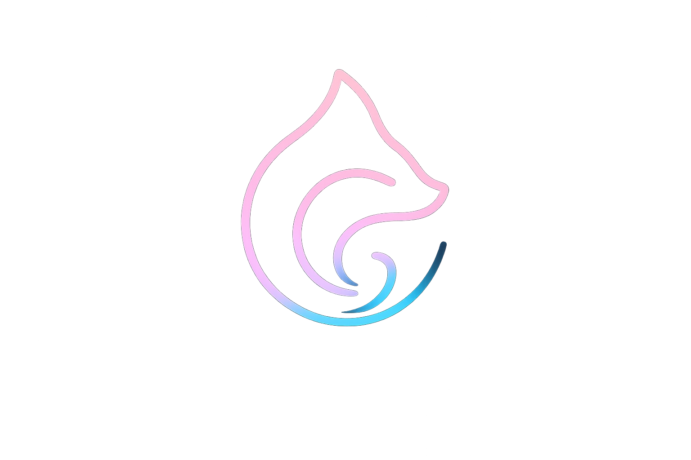

<p align="center">
  
</p>

<h1 align="center">LiraOS</h1>

<p align="center">
  A modern OS-style interface layer for the AI <b>Lira Amarinth</b>.
</p>

<p align="center">
  <a href="https://github.com/Rukafuu/LiraOS/stargazers">
    
  </a>
  <a href="https://github.com/Rukafuu/LiraOS/network/members">
    
  </a>
  <a href="https://github.com/Rukafuu/LiraOS/blob/main/LICENSE">
    
  </a>
  
</p>

<p align="center">
  
  
  
  
  
</p>

---

## 🔍 What is LiraOS?

**LiraOS** is a system-style UI for personal AI agents.  
It provides:

- A chat-centered workspace with OS-like layout  
- A modular shell for plugging in AI backends and tools  
- A consistent, futuristic visual identity for **Lira Amarinth**

Minimal backend assumptions: LiraOS focuses on **interface and architecture**, not on a specific model provider.

---

## ✨ Highlights

- **OS-style layout**: sidebar, main workspace, and contextual panels  
- **Chat interface** with timestamps and action buttons (copy, TTS-ready hooks)  
- **Dark / light theme** with shared design tokens  
- **Responsive by default** (desktop & mobile)  
- **Modular structure** ready for:
  - LLM backends (LiraCore, OpenAI, etc.)
  - STT / TTS providers
  - Tool & plugin systems
  - Future “self-improvement” / code-editing flows

---

## ⚙️ Tech Stack

- **React + Vite**
- **TypeScript**
- **TailwindCSS**
- **Framer Motion**
- **Context + hooks architecture**

---

## 🚀 Quick Start

```bash
git clone https://github.com/Rukafuu/LiraOS.git
cd LiraOS
npm install
npm run dev

Production build:

npm run build
npm run preview
```
```
🧱 Project Structure
src/
  assets/       # Logos, images, static media
  components/   # Reusable UI components
  layout/       # App shell, navigation, theming
  context/      # Global state providers
  hooks/        # Custom hooks
  modules/      # Future LiraOS modules
  pages/        # Main views
  utils/        # Helpers and shared utilities
```

```
📜 License

This project is licensed under the MIT License. 
